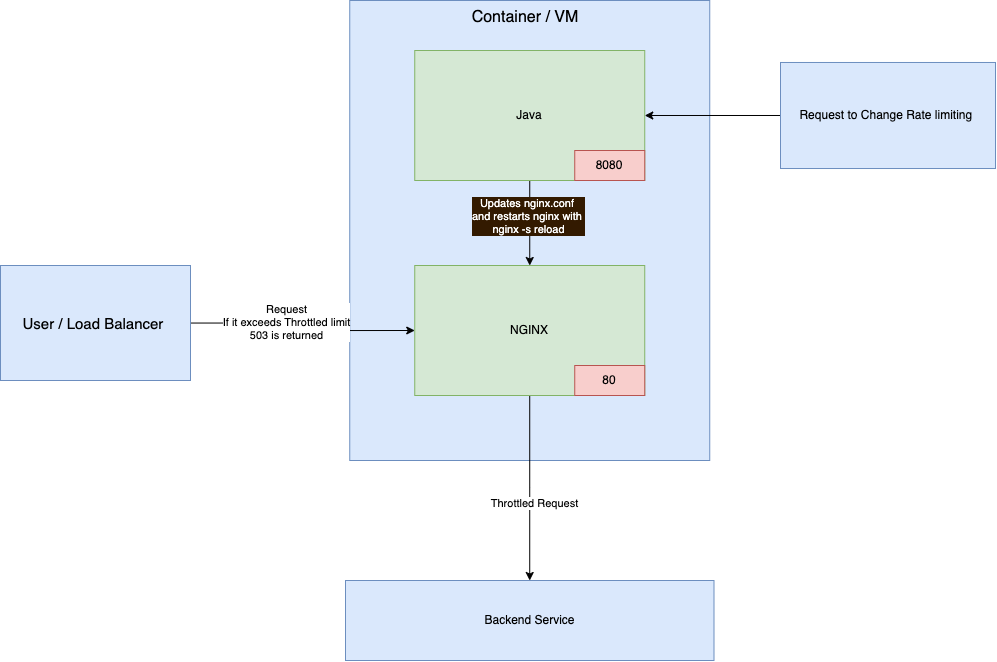

# Introduction

This is a repo showing a way to dynamically throttle requests using nginx 

This is achieved by having nginx and a lightweight spring rest service packaged into a single container. The spring rest service assumes the responsibility of editing the nginx config and restarting the service

Architecture:


### Prerequisite 
* Docker
* Maven
* Java 17

### Build steps

Copy paste below code into your terminal, make sure you are in the root of the project, i.e. the same directory as this README.md is at.

```shell
cd dynamic-throttling-web-api
mvn clean install
cd ..
docker build . -t nginx:ing
docker-compose up -d
```
after these command you will have your nginx running at port 80, and java app controlling nginx throttling at 8080

To test everything is working try this command:
`curl http://localhost`
you will either receive 200 HTTP/OK or 503 because of rate limiting.

### Dynamic throttling

When the `nginx:ing` container is running, by default the rate limiting is set at 5 request per minute. 

To validate rate limiting, you can execute a bash script located in this folder call `query.sh`, This scripts query http://localhost every second for a minute. You can notice in a minute only 5 request, respond with 200 rest with 503.

You can dynamically throttle rate limit by issuing following REST request:
```shell
POST http://localhost:8080/throttle?requestPerMinute=100
```
curl request:
```shell
curl --location --request POST 'http://localhost:8080/throttle?requestPerMinute=100' 
```
